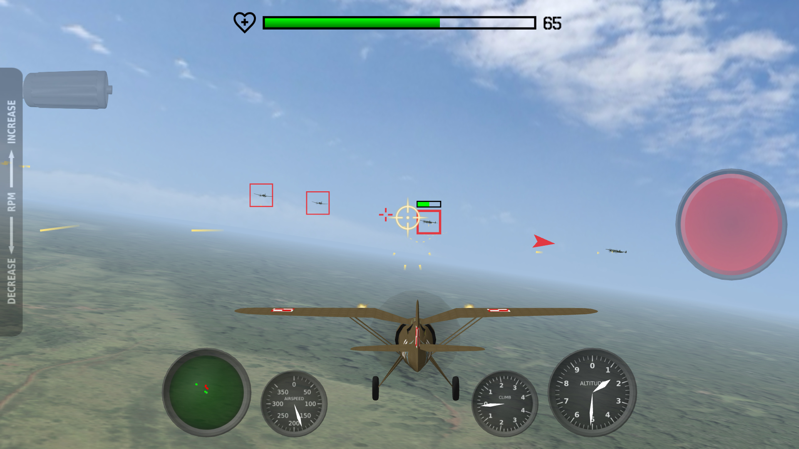
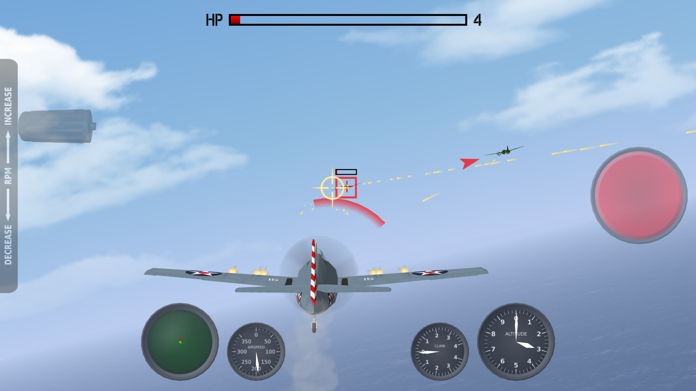
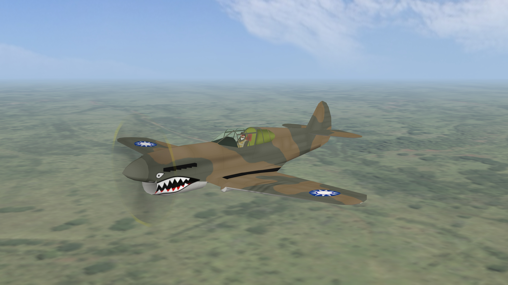
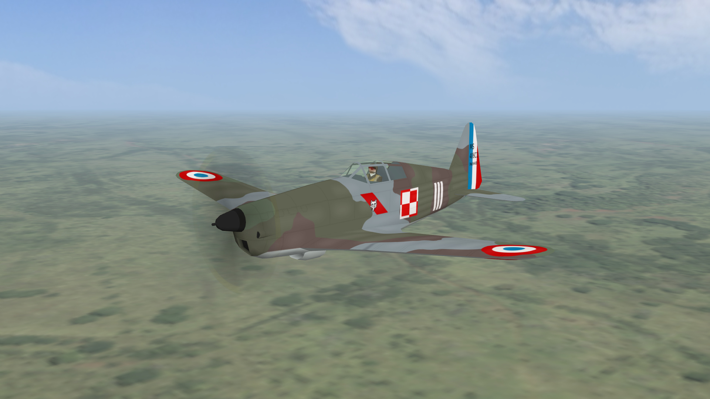
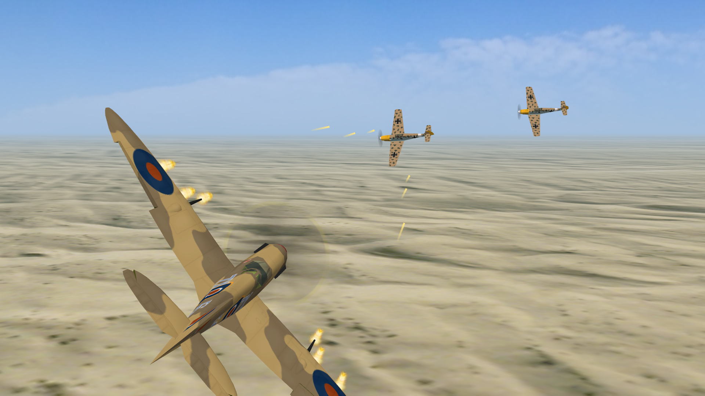
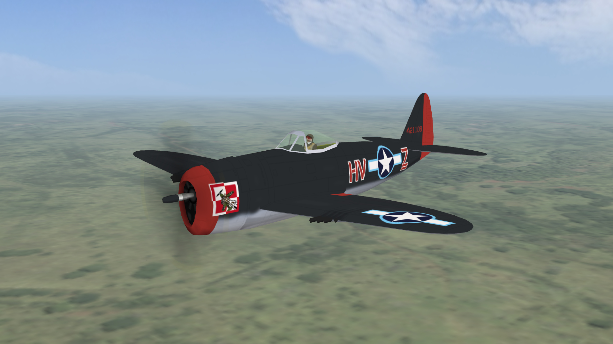

# fightersfs
Arcade style combat flight simulation game.

44 missions based on the actual events of World War 2. Defend Warsaw from German bombers, intercept Luftwaffe bombers during the Battle of Britain, destroy V-1 flying bombs threatening London, intercept Japanese bombers over Pearl Harbor, defend American base on Midway, fight against Japanese warbirds over Guadalcanal, cover American fleet on the Philippine Sea, cover land forces during battle of Berlin, defend ships from Kamikaze attacks.

Over 60 different unit types. 42 aircrafts types including 22 fighters. 18 warships types including 7 battleships, 5 destroyers and 4 aircraft carriers.

Almost 90 historically accurate aircraft liveries, including Polish Army Aviation, Luftwaffe, Armée de l'Air, Royal Air Force, US Army Air Forces, US Navy, US Marines, Fleet Air Arm, Royal Australian Air Force, Royal New Zealand Air Force, Chinese Nationalist Air Force, Royal Netherlands East Indies Army Air Force, Imperial Japanese Navy Air Service, Imperial Japanese Army Air Service and Polish People's Army Aviation.

Pilot one of the classic warplanes, including [AT-6 Texan](https://en.wikipedia.org/wiki/North_American_T-6_Texan), [F2A Buffalo](https://en.wikipedia.org/wiki/Brewster_F2A_Buffalo), [F4F Wildcat](https://en.wikipedia.org/wiki/Grumman_F4F_Wildcat), [F6F Hellcat](https://en.wikipedia.org/wiki/Grumman_F6F_Hellcat), [Hurricane](https://en.wikipedia.org/wiki/Hawker_Hurricane), [MS.406](https://en.wikipedia.org/wiki/Morane-Saulnier_M.S.406), [F4U Corsair](https://en.wikipedia.org/wiki/Vought_F4U_Corsair), [P.11](https://en.wikipedia.org/wiki/PZL_P.11), [P-36 Hawk](https://en.wikipedia.org/wiki/Curtiss_P-36_Hawk), [P-38 Lightning](https://en.wikipedia.org/wiki/Lockheed_P-38_Lightning), [P-40 Warhawk](https://en.wikipedia.org/wiki/Curtiss_P-40_Warhawk), [P-47 Thunderbolt](https://en.wikipedia.org/wiki/Republic_P-47_Thunderbolt), [P-51 Mustang](https://en.wikipedia.org/wiki/North_American_P-51_Mustang), [Spitfire](https://en.wikipedia.org/wiki/Supermarine_Spitfire) and [Yak-9](https://en.wikipedia.org/wiki/Yakovlev_Yak-9).

## See also:
- [fightersfs-data](https://github.com/marek-cel/fightersfs-data)
- [fightersfs-tools](https://github.com/marek-cel/fightersfs-tools)

